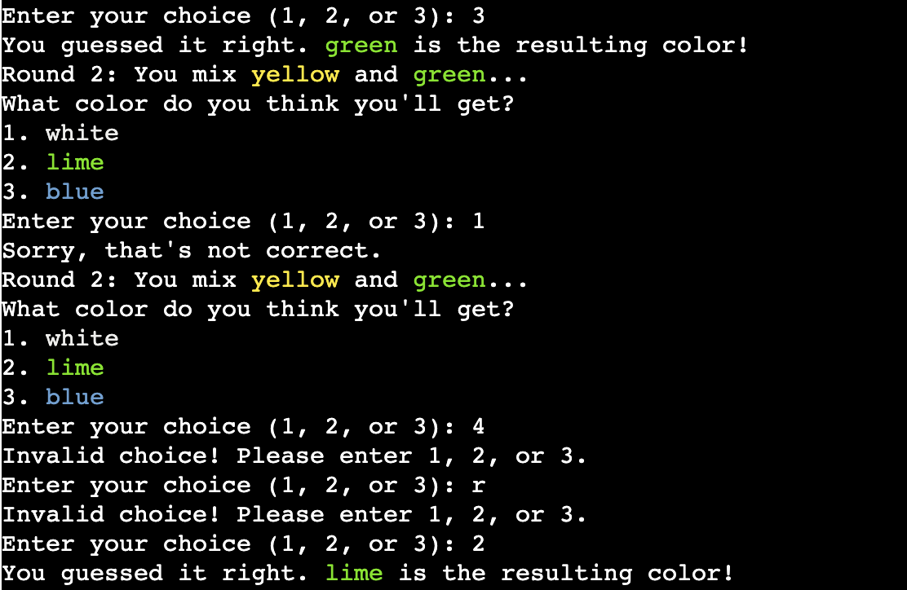

# Guess-Colors 

The Color Mixing Game is a simple guessing game where players are presented with two colors and are asked to guess the resulting color when those two colors are mixed together. It's a fun way to test one's understanding of color combinations and to learn about the outcomes of mixing different colors. 

The deployed project live link is [HERE](https://guess-colors-499273fe225a.herokuapp.com/) - ***Use Ctrl (Cmd) and click to open in a new window.*** 

## Contents

- [Introduction](#introduction)
- [Project](#project)
  - [User goals:](#user-goals)
  - [Site owner goals](#site-owner-goals)
- [Pre development](#pre-development)
- [Development](#development)
- [Features](#features)
  - [Slow Typing Instructions](#slow-typing-instructions)
  - [Name and profession input](#name-and-profession-input)
  - [Hourly pay and employee number](#hourly-pay-and-employee-number)
  - [Working dates, days and hours](#working-dates-days-and-hours)
  - [Confirm information so far](#confirm-information-so-far)
  - [Tax and National Insurance](#tax-and-national-insurance)
  - [Confirmation of information](#confirmation-of-information)
  - [What the portal checks](#what-the-portal-checks)
  - [Error Page](#error-page)
- [Google Sheets](#google-sheets)
  - [Payments](#payments)
  - [Tax](#tax)
- [Technologies Used](#technologies-used)
- [Resources](#resources)
  - [Libraries](#libraries)
- [Testing](#testing)
- [Future Updates](#future-updates)  
- [Validation](#validation)
- [Deployment](#deployment)
  - [Heroku](#heroku)
  - [Branching the GitHub Repository using GitHub Desktop and Visual Studio Code](#branching-the-github-repository-using-github-desktop-and-visual-studio-code)
- [Bugs](#bugs)
- [Credits](#credits)
- [Acknowledgements](#acknowledgements)

## Introduction

## Project 

The aim of this project is to:

- The primary goal is to provide players with an enjoyable gaming experience. The game offers a simple yet engaging activity that can be entertaining for people of various ages.
- Through gameplay, players can learn about color combinations and color mixing. It's a fun way to explore basic concepts of color theory and understand how different colors interact with each other.
- The game can help players improve their observational skills and ability to recognize color combinations. It also encourages critical thinking as players make educated guesses about the resulting color.

### User goals:

- The primary user goal for players is to correctly guess the resulting color when two random colors are mixed together.
- Players aim to achieve a high score by making accurate guesses within the given rounds.
- Ultimately, the goal is to have fun while engaging in a challenging and entertaining gameplay experience.

### Site owner goals

- From a developer's point of view, the user goal is to create an engaging and bug-free game that provides an enjoyable experience for players.
- Developers aim to implement features that make the game intuitive to play, such as clear instructions, easy-to-understand interface elements, and responsive feedback to user actions.
- They also strive to ensure that the game is free from technical issues and errors, providing a seamless experience for players.

### Pre development
I created a flow chart. All I had to do then is follow my flow chart and code one area at a time before moving on to the next. 

### Development

1 Creating the ASCII List: I started by defining an ASCII list containing color codes mapped to their respective names. This step likely involved researching ASCII color codes and compiling them into a dictionary for easy reference.

2 Designing the Header: Next, I designed the header for the game, which typically includes the game title, instructions, and any other relevant information to introduce players to the game.

3 Implementing Functions: After setting up the initial data structures, you proceeded to implement the necessary functions for the game logic. This includes functions for mixing colors, displaying instructions, presenting color options, getting user guesses, playing rounds, and managing the main game loop.

## Features

### Color Mixing

The core feature of the game is mixing two colors together to produce a resulting color. This feature involves randomly selecting two colors from a predefined list and determining the resulting color based on predefined combinations.

### Displaying Instructions

You implemented a function to display instructions for each round of the game. These instructions inform the player about the colors they are mixing and prompt them to guess the resulting color.

### Displaying Color Options

Another function displays the available color options for the player to choose from when guessing the resulting color. This feature ensures that the player has multiple choices to select from.

### Getting User Guesses

The game allows the player to guess the resulting color by selecting from the presented color options. You implemented a function to get the player's guess and validate it to ensure it's a valid choice.

### Playing Rounds

The game consists of multiple rounds, with each round presenting the player with a new color mixing scenario. The player has multiple attempts to guess the resulting color for each round.

### Scoring

The player earns points for each correct guess, and the game keeps track of the total score across multiple rounds. This scoring system adds a competitive element to the game, motivating the player to guess correctly.

### Game Over Conditions

The game ends if the player guesses incorrectly twice in a single round or if the player correctly guesses the resulting color in three rounds. These conditions determine when the game is over and whether the player wins or loses.

### Hourly pay and employee number
Once a contractor has selected their name and profession and confirms the information is correct, the computer brings up confirmation of their hourly pay and contractor number.

### Confirmation of information

Once the amount before and after tax has been shown the contractor can confirm that they would like this information submitted to HR. HR keep detailed information on the contractors they use and the hours they work. The information submitted is checked by a manager who confirms the working hours and days. Information on tax and NI payments is sent to the umbrella company.

### What the portal checks

A name is inputted and not left blank. Instructions are given to only use letters to avoid a delay in payment.

Profession is chosen from a list of options

The dates (must be within a two month period), the total number of days and hours worked.

As per Working Time Regulations 1998 a maximum of 13 hours are allowed in a day. App checks that less than 13 hours is inputted per day.

Hours can not exceed the dates.

Based on information provided a calculation is made to determine pay before tax and then pay after tax and NI deductions.

The program checks that the contractor is ready to submit this information. 

If they select yes, they receive confirmation of submission

If they select no, they are invited to re-submit, as shown above.

### Error Page

A 404 error page has been included. The html was run through the W3C html validator and errors removed. A css style file was created to support the display of the text on the page.

## Google Sheets

Using Google sheets wasn't part of the original project spec and was added after all the code was created, tested and working. The sheet contains two sections

### Payments
In this area the following contractor information is included:

- First name
- Last name
- Profession
- Start date
- End date
- Pay before tax

### Tax
In this area the following contractor information is included:

- First name
- Last name
- Profession
- Pay before tax
- Tax to pay
- National Insurance to pay

This information is sent to the umbrella company.

## Technologies Used

The main technology used to create this program is Python
HTML and CSS to change the background and add social media links.
Google API
Google Sheets

### Resources

- Codeanywhere 
- Visual Studio Code (VSC)
- GitHub 
- Heroku
- Affinity Publisher for help with images
- miro.com to create flow chart

### Libraries
[colorama Fore & Back](https://pypi.org/project/colorama/)
[random](https://docs.python.org/3/library/random.html) - to generate contractor number
[typing](https://www.101computing.net/python-typing-text-effect/))
[datetime](https://www.programiz.com/python-programming/datetime)
[sleep](https://www.programiz.com/python-programming/time/sleep) - function for delays in typing out lines

## Testing

The portal has been well tested and the results can be viewed [here - TESTING](https://github.com/todiane/corri-construction-p3/blob/main/TESTING.md)

## Future Updates

The next update of the app will include the option to choose whether it is their first visit (which will show the instructions) or whether they have used the service before - which will show the instructions behind a button.

The ability for a manager to log into the system and confirm working dates and days for each contractor all in one place rather than via separate emails.

Relevant information is accessible by the umbrella company so that HR doesn't have to collate and forward this information.

Other future updates are included in the TESTING.md file.

## Validation

PEP8 - Python style guide checker imported - https://pypi.org/project/pep8/
All code validated and where lines were showing as too long they were adjusted. Some line adjustments caused bugs in the code and it stopped working so I worked on it until the game worked again.

## Deployment

### Heroku

The Application has been deployed from GitHub to Heroku by following the steps:

1. Create or log in to your account at heroku.com
2. Create a new app, add a unique app name (for example guess-colors) and then choose your region
3. Click on create app
4. Go to "Settings"
5. Under Config Vars add the private API key information using key 'CRED' and into the value area copy the API key information added to the .json file.  Also add a key 'PORT' and value '8000'.
6. Add required buildpacks (further dependencies). For this project, set it up so Python will be on top and Node.js on bottom
7. Go to "Deploy" and select "GitHub" in "Deployment method"
8. To connect Heroku app to your Github repository code enter your repository name, click 'Search' and then 'Connect' when it shows below.
9.  Choose the branch you want to build your app from
10. If preferred, click on "Enable Automatic Deploys", which keeps the app up to date with your GitHub repository
11. Wait for the app to build. Once ready you will see the “App was successfully deployed” message and a 'View' button to take you to your deployed link.

### Branching the GitHub Repository using GitHub Desktop and Visual Studio Code
1. Go to the GitHub repository.
2. Click on the branch button in the left hand side under the repository name.
3. Give your branch a name.
4. Go to the CODE area on the right and select "Open with GitHub Desktop".
5. You will be asked if you want to clone the repository - say yes.
6. GitHub desktop will suggest what to do next - select Open code using Visual Studio Code.
   
The deployed project live link is [HERE](https://corri-construction-8c4725a33281.herokuapp.com/) - ***Use Ctrl (Cmd) and click to open in a new window.*** 

## Bugs

After importing the type element so that text can be typed out a line at a time the codes for Fore.WHITE or bold kept showing up e.g. '\033[1m' for bold was typed out. To fix this I had to remove - colorama.init(autoreset=True) - which  meant I had to go through each line of code to ensure if one line was red, all subsequent lines didn't turn red. 

## Credits

Free Code Camp Python for everyone course that helped me get my project started - [here](https://www.youtube.com/watch?v=wgkC8SxraAQ)

py4e autograder to help with checking maths - [here](https://www.py4e.com/tsugi/store/test/pythonauto )

Geek for Geek to help me use strip() to add required field for first/last name - [here](https://www.geeksforgeeks.org/python-program-to-check-if-string-is-empty-or-not/)

Help putting together the function that calculates income tax and national insurance I started with this video and adapted it - [here](https://www.youtube.com/watch?v=b4lok6-_GGg )

To change numerical value to end in two figures only - [here](https://tutorial.eyehunts.com/python/how-to-display-2-decimal-places-in-python-example-code/)

Using colorama import - [here](https://www.youtube.com/watch?v=u51Zjlnui4Y )

Being able to bold and center font - taken from w3Schools - [here](https://www.w3schools.com/python/ref_string_center.asp)

## Acknowledgements

Code Institute women-in-tech group for their support during huddles and when reviewing my code.

Peer-review slack channel for help trying to find any issues/break the code.

Tutor support for help with figuring out how to round numbers in Google sheet.

Travis.media community - To help with date/hours/time function so it worked correctly.

My mentor Andre Aquilina for teaching me about the proper structure for code - e.g. imports, functions, main code and for encouraging me to create the Google sheets addition and for helping with explaining coding.