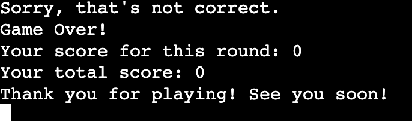

# Guess-Colors 

The Color Mixing Game is a simple guessing game where players are presented with two colors and are asked to guess the resulting color when those two colors are mixed together. It's a fun way to test one's understanding of color combinations and to learn about the outcomes of mixing different colors. 

The deployed project live link is [HERE](https://guess-colors-499273fe225a.herokuapp.com/) - ***Use Ctrl (Cmd) and click to open in a new window.*** 

## Contents

- [Introduction](#introduction)
- [Project](#project)
  - [User goals:](#user-goals)
  - [Site owner goals](#site-owner-goals)
- [Pre development](#pre-development)
- [Development](#development)
- [Features](#features)
- [Technologies Used](#technologies-used)
- [Resources](#resources)
  - [Libraries](#libraries)
- [Testing](#testing)
- [Future Updates](#future-updates)  
- [Validation](#validation)
- [Deployment](#deployment)
  - [Heroku](#heroku)
  - [Branching the GitHub Repository using GitHub Desktop and Visual Studio Code](#branching-the-github-repository-using-github-desktop-and-visual-studio-code)
- [Bugs](#bugs)
- [Credits](#credits)
- [Acknowledgements](#acknowledgements)

## Introduction

## Project 

The aim of this project is to:

- The primary goal is to provide players with an enjoyable gaming experience. The game offers a simple yet engaging activity that can be entertaining for people of various ages.
- Through gameplay, players can learn about color combinations and color mixing. It's a fun way to explore basic concepts of color theory and understand how different colors interact with each other.
- The game can help players improve their observational skills and ability to recognize color combinations. It also encourages critical thinking as players make educated guesses about the resulting color.

### User goals:

- The primary user goal for players is to correctly guess the resulting color when two random colors are mixed together.
- Players aim to achieve a high score by making accurate guesses within the given rounds.
- Ultimately, the goal is to have fun while engaging in a challenging and entertaining gameplay experience.

### Site owner goals

- From a developer's point of view, the user goal is to create an engaging and bug-free game that provides an enjoyable experience for players.
- Developers aim to implement features that make the game intuitive to play, such as clear instructions, easy-to-understand interface elements, and responsive feedback to user actions.
- They also strive to ensure that the game is free from technical issues and errors, providing a seamless experience for players.

### Pre development
I created a flow chart. All I had to do then is follow my flow chart and code one area at a time before moving on to the next. 

### Development

1 Creating the ASCII List: I started by defining an ASCII list containing color codes mapped to their respective names. This step likely involved researching ASCII color codes and compiling them into a dictionary for easy reference.

2 Designing the Header: Next, I designed the header for the game, which typically includes the game title, instructions, and any other relevant information to introduce players to the game.

3 Implementing Functions: After setting up the initial data structures, you proceeded to implement the necessary functions for the game logic. This includes functions for mixing colors, displaying instructions, presenting color options, getting user guesses, playing rounds, and managing the main game loop.

## Features

### Color Mixing

The core feature of the game is mixing two colors together to produce a resulting color. This feature involves randomly selecting two colors from a predefined list and determining the resulting color based on predefined combinations.

### Displaying Instructions

You implemented a function to display instructions for each round of the game. These instructions inform the player about the colors they are mixing and prompt them to guess the resulting color.

### Displaying Color Options

Another function displays the available color options for the player to choose from when guessing the resulting color. This feature ensures that the player has multiple choices to select from.

### Getting User Guesses

The game allows the player to guess the resulting color by selecting from the presented color options. You implemented a function to get the player's guess and validate it to ensure it's a valid choice.

### Playing Rounds

The game consists of multiple rounds, with each round presenting the player with a new color mixing scenario. The player has multiple attempts to guess the resulting color for each round.

### Scoring

The player earns points for each correct guess, and the game keeps track of the total score across multiple rounds. This scoring system adds a competitive element to the game, motivating the player to guess correctly.

### Game Over Conditions

The game ends if the player guesses incorrectly twice in a single round or if the player correctly guesses the resulting color in three rounds. These conditions determine when the game is over and whether the player wins or loses.

## Technologies Used

- Python to develop this project.
- [Random](https://docs.python.org/3/library/random.html) library to generate randomness in the project.
- [Git](https://git-scm.com/) for version control.
- [GitPod](https://www.gitpod.io/) as IDE to create this project.
- [GitHub](https://github.com/) to store files for the website.
- [Lucidchart](https://www.lucidchart.com/) to create the flowchart.
- [Heroku](https://www.heroku.com/) to deploy this project.
- [Python Tutor](https://pythontutor.com/) to debug my code.
- [Python Validator](https://pep8ci.herokuapp.com/#) by Code Institute to catch some errors and validate my code.

### Resources

- Codeanywhere 
- Visual Studio Code (VSC)
- GitHub 
- Heroku

### Libraries

[www.stackoverfow.com](https://stackoverflow.com/questions/287871/how-do-i-print-colored-text-to-the-terminal) - to get colors for python
[random](https://docs.python.org/3/library/random.html) - to generate random colors
[ChatGPT](https://chatgpt.com/) - to create color combination to the resulting colors

## Testing

The game has been tested and the results can be viewed [here - TESTING](TESTING.md)

## Future Updates

- More Complex Color Mixing Rules
  Introduce secondary and tertiary colors, and add more complex rules for mixing multiple colors.
  Add a color wheel to show relationships between colors and how they mix.

- Different Levels of Difficulty
  Implement different levels of difficulty where easier levels have more straightforward color combinations and harder levels involve more complex mixes.
  Add time constraints for higher levels to increase the challenge.

- User Interface Improvements
  Develop a graphical user interface (GUI) using a library for a more interactive experience.
  Include color swatches that visually represent the colors being mixed and the resulting color.

## Deployment

### Heroku

The Application has been deployed from GitHub to Heroku by following the steps:

1. Create or log in to your account at heroku.com
2. Create a new app, add a unique app name (for example guess-colors) and then choose your region
3. Click on create app
4. Go to "Settings"
5. Under Config Vars add the private API key information using key 'CRED' and into the value area copy the API key information added to the .json file.  Also add a key 'PORT' and value '8000'.
6. Add required buildpacks (further dependencies). For this project, set it up so Python will be on top and Node.js on bottom
7. Go to "Deploy" and select "GitHub" in "Deployment method"
8. To connect Heroku app to your Github repository code enter your repository name, click 'Search' and then 'Connect' when it shows below.
9.  Choose the branch you want to build your app from
10. If preferred, click on "Enable Automatic Deploys", which keeps the app up to date with your GitHub repository
11. Wait for the app to build. Once ready you will see the “App was successfully deployed” message and a 'View' button to take you to your deployed link.

### Branching the GitHub Repository using GitHub Desktop and Visual Studio Code
1. Go to the GitHub repository.
2. Click on the branch button in the left hand side under the repository name.
3. Give your branch a name.
4. Go to the CODE area on the right and select "Open with GitHub Desktop".
5. You will be asked if you want to clone the repository - say yes.
6. GitHub desktop will suggest what to do next - select Open code using Visual Studio Code.
   
The deployed project live link is [HERE](https://guess-colors-499273fe225a.herokuapp.com/) - ***Use Ctrl (Cmd) and click to open in a new window.*** 

## Credits

- CodeInstitute learn material

- Colored Console Output in Python - [here](https://www.youtube.com/watch?v=kf8kbUKeM5g)

- Using colorama import - [here](https://www.youtube.com/watch?v=u51Zjlnui4Y )

## Acknowledgements

I would like to acknowledge the following people:

*   Kay Welfare - My cohort facilitator.
*   My Code Institute Mentor Jubril Akolade.
